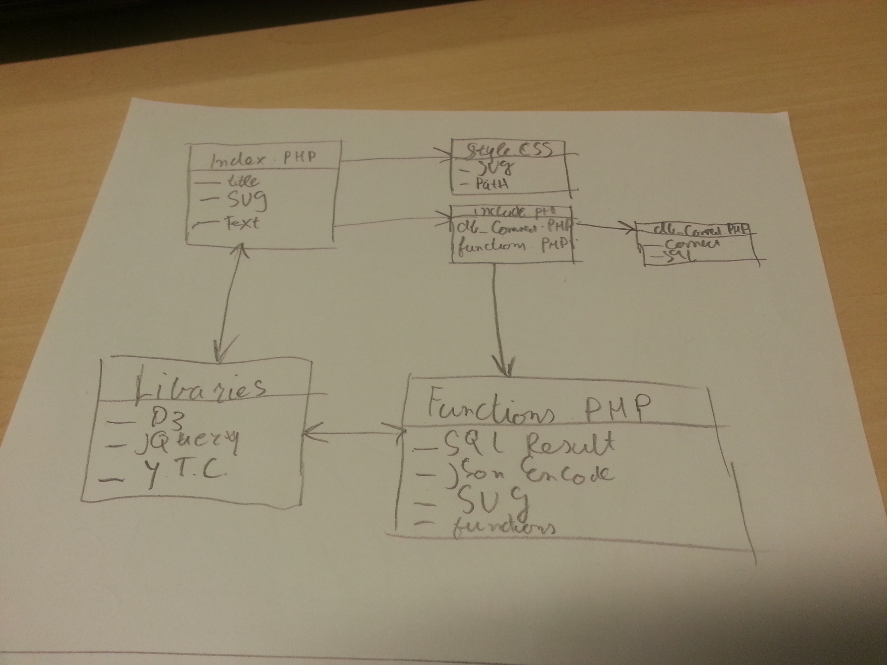
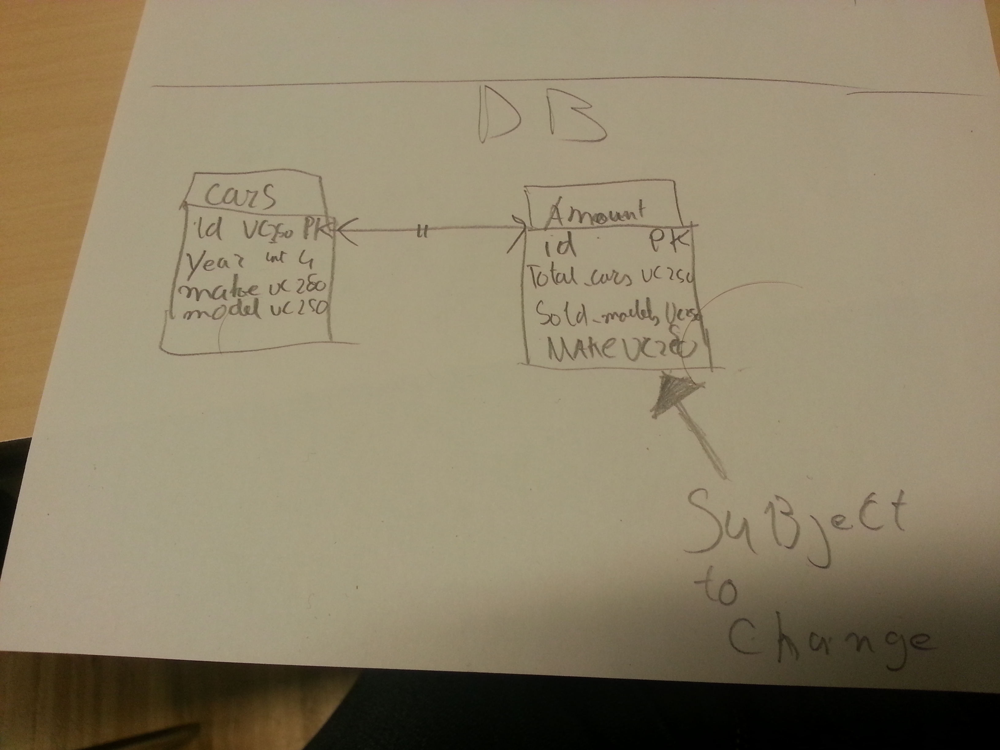
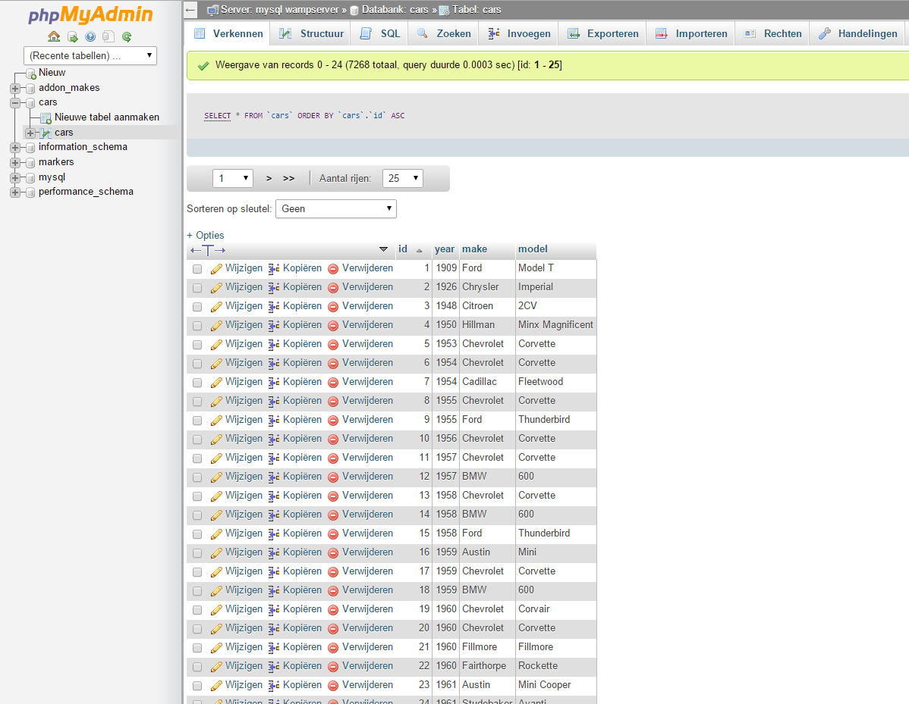
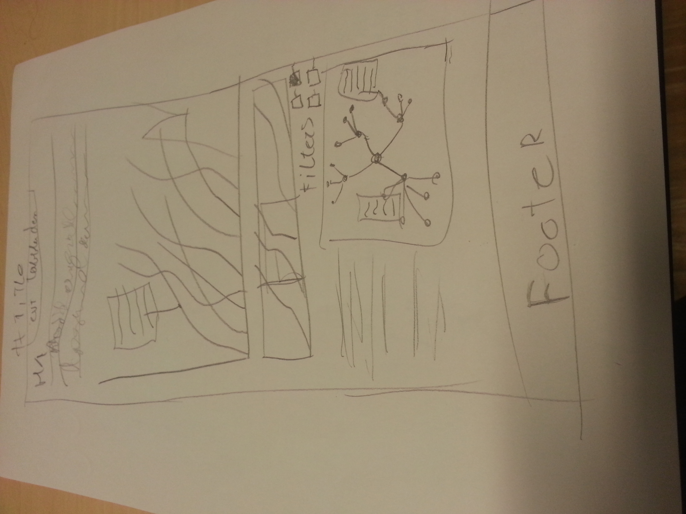

# Design Document
 
## A list of classes and public methods (and their return types and/or arguments) that you’ve decided to implement
In onderstaande afbeelding staat een overzicht van hoe de situatie er nu uit ziet en in alle waarschijnlijkheid ook zal blijven. Even kort uitgelegd wat het meest spannende is om toe te lichten. Als je op de index.php pagina belandt dan wordt vanuit daar alles extern ingeladen, dit zorgt ervoor dat overzicht behoudt wordt en dat fouten gemakkelijk zijn op te sporen.

Alleerst worden de php includes gedaan, waarmee een verbinding met de database wordt gelegd, tevens komt er ook een bestand bij dat voornamelijk uit javascript bestaat maar toch functions.php heet. Dit komt omdat in dat bestand de waardes uit de database worden omgezet naar PHP-values en die worden dan weer door JSON-encode omgezet naar een variabele in Javascript. Maar de PHP-code kan niet werken als het bestand .js als extentie heeft. Toch wordt alles omtrend de visualisatie hierin afgehandeld. Zoals de grafieken, en filters die in de loop van de tijd gebouwd zullen worden.

## Advanced sketches of UIs that clearly explain which features are connected to which underlying classes
In bovenstaande afbeelding is dit ook al voor een groot gedeelte toegelicht. Belangrijk om te noteren is dat alle files met elkaar verbonden zijn en dat er van iedere file iets wordt gebruikt om mee te werken. Dus in CSS staat alleen maar CSS in de index staat op de PHP includes na alleen maar HTML met de imports en svg/canvassen waar op gewerkt gaat worden. 

De enige die echt erg verschilt met de andere is functions.php, wat ik eerder al heb toegelicht dat daar voornamelijk JavaScript in voor gaat komen. Verder is er nu nog maar weinig over te zeggen, in de loop van de dagen als alles wat meer vorm krijgt, kan dit document eventueel veranderen of worden uitgebreid.

## A list of APIs and frameworks that you will be using to provide functionality in your app
Voor het maken van de visualisatie wordt er gebruik gemaakt van de D3-library, voor de database wordt er gebruik gemaakt van PHPmyAdmin en voor de rest de standaard talen die iedere browser ondersteund. In het vervolg bestaat er de kans dat eventueel jQuery en misschien nog andere libraries worden toegevoegd, maar voor nu kan daar nog geen indicatie over worden gegeven.

## A list of data sources, and database tables and fields (and their types) that you’ve decided to implement

Spreekt redelijk voor zich, de database die nu gebruikt wordt moet nog worden uitgebreid zoals op de tekening, en indien mogelijk nog verder als alle data beschikbaar is

Hieronder nog een tijdelijke schets van hoe de webpagina er ongeveer uit komt te zien

