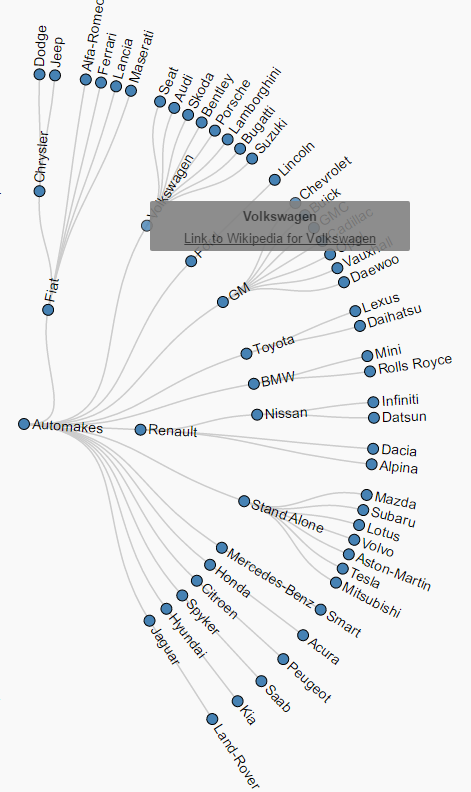

# DataProject
 
## Carmakes for dummies
Bij deze visualisatie gaat het erom om iedereen die niet zo bekend is met auto's (en dat wel graag wilt zijn!) te helpen om dit te bereiken. Deze Visualisatie biedt informatie zoals het land van oorsprong waar automerken vandaan komen, de onderlinge relaties tussen automerken met externe extra informatie. En als laatste is er ook een overzicht waarin te zien is welk autobedrijf het snelste groeit (Aan de hand van de hoeveelheid geproduceerde modellen). Al deze visualisaties moeten bijdragen aan het verrijken van de kennis van de gebruiker.

## Credits
Uiteraard is er gebruikt van de D3 library voor JavaScript, Credits and code all goes to the rightful owners.
Verder is deze visualisatie gemaakt door : Jordi Jonkergouw met studentennummer 11083603

-unlicensed-

## LICENSE
a public domain release, which releases your code to the public without any restrictions (you could also use the unlicense for this)